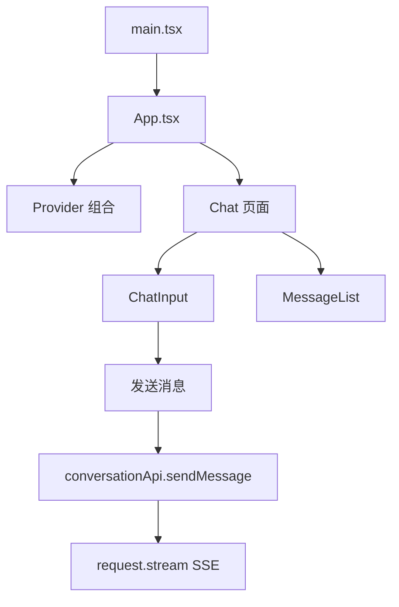
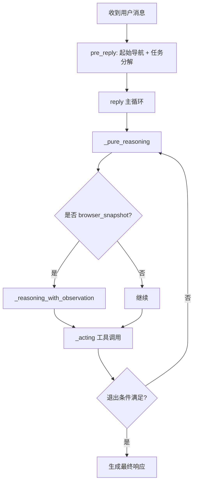
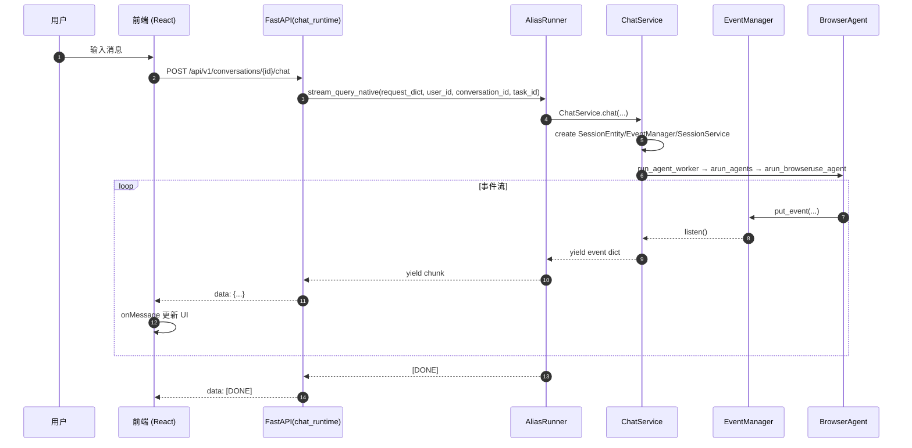
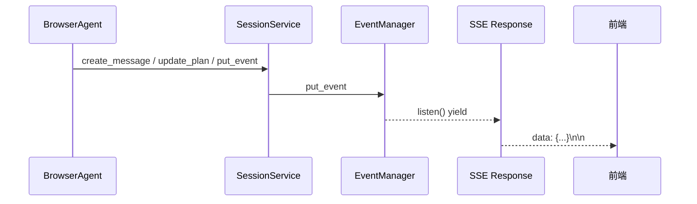

# Alias 项目前后端交互流程详解（已对齐当前代码）

> 本文档梳理从前端发起请求到后端处理的完整流程，重点分析 Browser Agent 的交互逻辑。已按当前代码实现修订。

---

## 0. 审查问题记录（已修订）

以下是审查时发现的关键不一致点，已在正文中修正：

- 前端请求体字段与文档不一致：实际是 `query/files/chat_type/language_type/chat_mode/roadmap`，非 `content/file_ids/mode`。
- `Request.stream` 签名与解析逻辑描述错误：实际含鉴权、401 刷新、`[DONE]` 处理及 `onDoneCallback`。
- `chat_runtime` 的 SSE 包装逻辑错误：实际通过 `_to_raw_sse_event` 统一包裹并处理异常。
- `stream_query_native` 上下文来源错误：`user_id/conversation_id/task_id` 来自 kwargs，而非 request body。
- 停止接口路径写错：实际是 `/conversations/{conversation_id}/chat/{task_id}/stop`。
- `AliasRunner -> ChatService` 的流式链路描述不匹配：实际是透明转发 ChatService 的输出并附加 `[DONE]`。
- `arun_agents/arun_browseruse_agent` 形参/返回值与行为不匹配：实际从 `session_entity.chat_mode` 选路由，`BrowserAgent` 通过 `await browser_agent()` 运行。
- `BrowserAgent` 主循环步骤与方法名不匹配：实际使用 `_pure_reasoning`、`_acting`，并在需要时触发 `_reasoning_with_observation`。
- MCP 工具列表不完整：实际工具集合远多于文档旧版列表。

---

## 1. 项目架构概览

### 1.1 整体架构图（对齐当前代码）

```mermaid
graph TB
    subgraph Frontend["前端 (React + Vite)"]
        A1[main.tsx\n应用入口]
        A2[App.tsx\n根组件]
        A3[Chat 页面\n消息发送/展示]
        A4[conversation.ts\nAPI 服务]
        A5[request.ts\nSSE 请求]
    end

    subgraph Backend["后端 (FastAPI)"]
        B1[main.py\n应用入口]
        B2[api/router.py\n路由聚合]
        B3[api/v1/chat_runtime.py\nSSE 路由]
        B4[AliasRunner\n运行时兼容 Runner]
        B5[ChatService\n对话服务]
        B6[EventManager\n事件管理]
    end

    subgraph Agent["Agent 层"]
        C1[run.py\nAgent 入口]
        C2[BrowserAgent]
        C3[DeepResearchAgent]
        C4[DataScienceAgent]
        C5[MetaPlanner]
    end

    A1 --> A2 --> A3 --> A4 --> A5
    A5 -->|POST /api/v1/conversations/{id}/chat| B3
    B1 --> B2 --> B3 --> B4 --> B5 --> B6
    B5 --> C1 --> C2
    C1 --> C3
    C1 --> C4
    C1 --> C5
```

### 1.2 目录结构

```
alias/
├── frontend/
│   └── src/
│       ├── main.tsx
│       ├── App.tsx
│       ├── routes/
│       ├── pages/Chat/
│       └── services/api/
│
├── src/alias/
│   ├── server/
│   │   ├── main.py
│   │   ├── api/
│   │   ├── services/
│   │   ├── core/
│   │   └── models/
│   ├── runtime/
│   │   ├── runtime_compat/
│   │   └── alias_sandbox/
│   └── agent/
│       ├── agents/
│       ├── tools/
│       └── run.py
```

---

## 2. 前端请求发送流程

### 2.1 前端组件层级



### 2.2 消息发送（真实请求体）

**文件**: `frontend/src/services/api/conversation.ts`

```typescript
sendMessage(
  conversationId: string,
  message: string,
  onMessage: (data: SSEResponse) => void,
  onError?: (error: any) => void,
  chat_type: string = "task",
  files: string[] = [],
  language_type: string = LANGUAGETYPE.en_US,
  chatMode: ChatModeType = ChatModeType.GENERAL,
  abortController?: AbortController,
  roadmap?: RoadMapMessage | null,
) {
  const requestBody = {
    query: message,
    files,
    chat_type,
    language_type,
    chat_mode: chatMode,
    roadmap,
  };

  return request.stream(
    `/api/v1/conversations/${conversationId}/chat`,
    onMessage,
    onError,
    requestBody,
    abortController,
  );
}
```

### 2.3 SSE 解析与 `[DONE]` 处理

**文件**: `frontend/src/services/api/request.ts`

```typescript
async stream(url, onMessage, onError, body, abortController) {
  const response = await fetch(`${BASE_URL}${url}`, {
    method: "POST",
    headers: {
      "Content-Type": "application/json",
      Authorization: `Bearer ${this.getAccessToken()}`,
    },
    body: body ? JSON.stringify(body) : undefined,
    signal: abortController?.signal,
  });

  if (response.status === 401) {
    await this.refreshToken();
    return this.stream(url, onMessage, onError, body, abortController);
  }

  const reader = response.body?.getReader();
  let buffer = "";
  let task_id = "";
  let conversation_id = "";
  let message_id = "";

  while (true) {
    const { done, value } = await reader.read();
    if (done) break;

    buffer += new TextDecoder().decode(value);
    const lines = buffer.split("\n");
    buffer = lines.pop() || "";

    for (const line of lines) {
      if (!line.startsWith("data: ")) continue;
      const data = line.slice(5).trim();
      if (data === "[DONE]") {
        onDoneCallback?.(conversation_id, task_id, message_id);
        return;
      }
      const parsed = JSON.parse(data);
      task_id = parsed?.task_id || "";
      conversation_id = parsed?.conversation_id || "";
      message_id = parsed?.message_id || "";
      if (parsed?.code && parsed?.message) {
        onError?.(parsed);
        return;
      }
      onMessage(parsed);
    }
  }
}
```

---

## 3. 后端请求处理流程（Runtime 兼容路径）

### 3.1 FastAPI 应用初始化

**文件**: `src/alias/server/main.py`

```python
app = FastAPI(title="Alias API", description="AI Agent Platform API", version="1.0.0")
app.include_router(api_router, prefix="/api")
```

### 3.2 API 路由链路

```mermaid
graph LR
    A[main.py] --> B[api/router.py]
    B --> C[api/v1/__init__.py]
    C --> D[chat_runtime.py]

    subgraph 路由路径
        D -->|POST /conversations/{conversation_id}/chat| E[chat]
        D -->|POST /conversations/{conversation_id}/chat/{task_id}/stop| F[stop_chat]
    end
```

### 3.3 SSE 事件生成

**文件**: `src/alias/server/api/v1/chat_runtime.py`

```python
async def event_generator(runner, request_dict, **runner_kwargs):
    try:
        async for chunk in runner.stream_query_native(request_dict, **runner_kwargs):
            yield _to_raw_sse_event(chunk)
    except Exception as e:
        if not isinstance(e, BaseError):
            e = BaseError(code=500, message=str(e))
        yield _to_raw_sse_event({"code": e.code, "message": e.message})
        yield _to_raw_sse_event("[DONE]")
```

**要点**:
- 统一通过 `_to_raw_sse_event` 输出 `data: ...\n\n`。
- Runner 返回 `[DONE]` 后转为 SSE 结束事件。
- 异常会被包装成 `{code, message}` 事件再结束。

### 3.4 AliasRunner（运行时兼容 Runner）

**文件**: `src/alias/runtime/runtime_compat/runner/alias_runner.py`

```python
async def stream_query_native(self, request, **kwargs):
    if not self._health:
        raise RuntimeError("Runner has not been started...")

    req_dict = request if isinstance(request, dict) else request.model_dump()
    user_id = kwargs.get("user_id") or self._to_uuid(req_dict.get("user_id"))
    conversation_id = kwargs.get("conversation_id") or self._to_uuid(req_dict.get("conversation_id"))
    task_id = kwargs.get("task_id") or self._to_uuid(req_dict.get("task_id")) or uuid.uuid4()

    if user_id is None or conversation_id is None:
        yield {"error": "missing_context", "code": 422, "message": "Native mode requires user_id and conversation_id in kwargs or request body."}
        return

    chat_request_obj = ChatRequest.model_validate(req_dict)
    result = await self.query_handler(user_id=user_id, conversation_id=conversation_id, task_id=task_id, chat_request=chat_request_obj)

    async for chunk in result:
        yield chunk

    yield "[DONE]"
```

**要点**:
- `user_id/conversation_id/task_id` 来自 `event_generator(..., kwargs)`，不是请求体。
- 直接透明转发 `ChatService.chat` 的输出流，最后附加 `[DONE]`。

### 3.5 ChatService（事件驱动核心）

**文件**: `src/alias/server/services/chat_service.py`

```python
async def chat(self, user_id, conversation_id, chat_request, task_id=None):
    # 1. 落库用户消息 + 初始化 sandbox
    # 2. 构建 SessionEntity / EventManager / SessionService
    # 3. asyncio.create_task(run_agent_worker(...))
    # 4. return self.handle_chat_response(session_service)
```

**要点**:
- Agent 通过事件流输出，`handle_chat_response` 把事件转成前端可消费的 JSON 块。
- `run_agent_worker` 会在结束时发送 `StopEvent`，`handle_chat_response` 监听到后停止输出。

---

## 4. Browser Agent 详细分析

### 4.1 Agent 选择机制

**文件**: `src/alias/agent/run.py`

```python
async def arun_agents(session_service, sandbox=None):
    chat_mode = session_service.session_entity.chat_mode
    if chat_mode == "dr":
        await arun_deepresearch_agent(session_service, sandbox)
    elif chat_mode == "browser":
        await arun_browseruse_agent(session_service, sandbox)
    elif chat_mode == "ds":
        await arun_datascience_agent(session_service, sandbox)
    elif chat_mode == "finance":
        await arun_finance_agent(session_service, sandbox)
    else:
        await arun_meta_planner(session_service, sandbox)
```

### 4.2 BrowserAgent 初始化与启动

**文件**: `src/alias/agent/run.py`

```python
async def arun_browseruse_agent(session_service, sandbox=None, browser_backend="playwright"):
    model, formatter = MODEL_FORMATTER_MAPPING[MODEL_CONFIG_NAME]
    browser_toolkit = AliasToolkit(
        sandbox,
        add_all=True,
        is_browser_toolkit=True,
        browser_backend=browser_backend,
    )
    await prepare_data_sources(session_service, sandbox, browser_toolkit, llm_call_manager)

    browser_agent = BrowserAgent(
        model=model,
        formatter=formatter,
        memory=InMemoryMemory(),
        toolkit=browser_toolkit,
        max_iters=50,
        start_url="https://www.google.com",
        session_service=session_service,
        state_saving_dir=f"./agent-states/run_browser-{time_str}",
    )
    await browser_agent()  # 通过 __call__ 运行
```

### 4.3 BrowserAgent 执行流程（对齐实现）

**文件**: `src/alias/agent/agents/_browser_agent.py`

**关键流程**:
- `pre_reply` 钩子里会进行起始页导航与任务分解（`_task_decomposition_and_reformat`）。
- `reply()` 主循环：`_pure_reasoning` → 工具调用 `_acting` → 必要时 `_reasoning_with_observation`。
- 退出条件：生成结构化输出、无工具调用、或达到 `max_iters`。



### 4.4 浏览器工具（MCP Server 实际工具集）

**文件**: `src/alias/runtime/alias_sandbox/box/agent_browser_mcp_server.py`

已注册工具包括但不限于：
- `browser_navigate`
- `browser_back`
- `browser_forward`
- `browser_reload`
- `browser_snapshot`
- `browser_screenshot`
- `browser_click`
- `browser_fill`
- `browser_type`
- `browser_press`
- `browser_hover`
- `browser_scroll`
- `browser_select`
- `browser_wait`
- `browser_get_text`
- `browser_get_url`
- `browser_get_title`
- `browser_is_visible`
- `browser_tab_list`
- `browser_tab_new`
- `browser_tab_switch`
- `browser_tab_close`
- `browser_eval`
- `browser_close`
- `browser_find_click`
- `browser_find_fill`

---

## 5. 完整时序图（对齐现实现）

### 5.1 端到端请求流程



### 5.2 事件流转



---

## 6. 关键代码文件索引（对齐现版本）

### 6.1 前端文件

- `frontend/src/pages/Chat/index.tsx`
- `frontend/src/services/api/conversation.ts`
- `frontend/src/services/api/request.ts`

### 6.2 后端 API 文件

- `src/alias/server/main.py`
- `src/alias/server/api/router.py`
- `src/alias/server/api/v1/__init__.py`
- `src/alias/server/api/v1/chat_runtime.py`

### 6.3 运行时与服务

- `src/alias/runtime/runtime_compat/runner/alias_runner.py`
- `src/alias/server/services/chat_service.py`
- `src/alias/server/services/session_service.py`
- `src/alias/server/core/event_manager/`

### 6.4 Agent 文件

- `src/alias/agent/run.py`
- `src/alias/agent/agents/_browser_agent.py`
- `src/alias/agent/tools/alias_toolkit.py`

---

## 7. Debug 建议断点位置（对齐现实现）

### 7.1 前端断点

**文件**: `frontend/src/services/api/request.ts`

```typescript
// 断点 1: SSE 行解析入口
for (const line of lines) {
  if (line.startsWith("data: ")) {
    debugger;
  }
}

// 断点 2: [DONE] 分支
if (data === "[DONE]") {
  debugger;
}
```

### 7.2 后端 API 断点

**文件**: `src/alias/server/api/v1/chat_runtime.py`

```python
# 断点 1: chat 入口
@router.post("/{conversation_id}/chat")
async def chat(...):
    import pdb; pdb.set_trace()

# 断点 2: event_generator
async for chunk in runner.stream_query_native(...):
    import pdb; pdb.set_trace()
```

### 7.3 Runner 断点

**文件**: `src/alias/runtime/runtime_compat/runner/alias_runner.py`

```python
# 断点: stream_query_native 参数解析
user_id = kwargs.get("user_id") or ...
```

### 7.4 ChatService 断点

**文件**: `src/alias/server/services/chat_service.py`

```python
# 断点 1: chat() 创建 SessionEntity 前
import pdb; pdb.set_trace()

# 断点 2: handle_chat_response 监听事件
async for event in session_service.listen():
    import pdb; pdb.set_trace()
```

### 7.5 BrowserAgent 断点

**文件**: `src/alias/agent/agents/_browser_agent.py`

```python
# 断点 1: reply() 主循环推理后
msg_reasoning = await self._pure_reasoning(tool_choice)
import pdb; pdb.set_trace()

# 断点 2: 工具执行入口
async def _acting(self, tool_call):
    import pdb; pdb.set_trace()
```

---

## 附录: 常见问题排查

### Q1: 前端收不到 SSE 事件？

排查路径：
- `chat_runtime.event_generator` 是否产出 SSE。
- `AliasRunner.stream_query_native` 是否报 422（user_id/conversation_id 缺失）。
- `ChatService.handle_chat_response` 是否在 `session_service.listen()` 收到事件。

### Q2: BrowserAgent 卡住不动？

排查路径：
- 是否已触发起始页导航与任务分解（pre_reply 钩子）。
- `_pure_reasoning` 是否一直输出工具调用但工具失败。
- `max_iters` 是否达到上限。

### Q3: 事件丢失或重复？

排查路径：
- `EventManager.listen()` 是否被多处消费。
- SSE 网络中断导致的前端重连/重复消费。

---

*文档版本: 1.1*
*最后更新: 2026-03-10*
